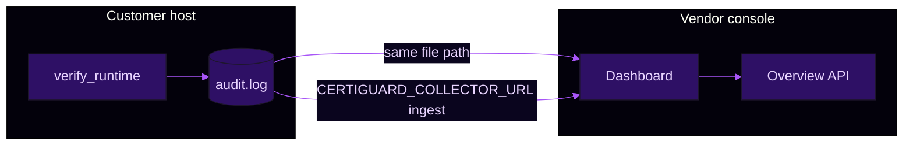

<!-- CertiGuard vendor console copy: dark shell, purple accent, severity chips. Mirrors UI in src/certiguard/ui/src/styles/theme.css + OverviewPage. -->

# Demo and end-to-end test methodology

<p align="center"><strong>CertiGuard Vendor Console — Demo Runbook</strong></p>

<p align="center"><sub>Real-time license protection and threat monitoring · same vocabulary as <code>Overview</code> / <code>Audit Logs</code> / <code>Risk</code> in the React dashboard</sub></p>

---

## Visual alignment with the dashboard

The React app uses a **deep space** shell with **neon purple** accents (see `src/certiguard/ui/src/styles/theme.css`). This document uses the same **semantic colors** as the Overview cards so judges and engineers map prose to pixels.

| Token (CSS variable) | Hex (light `:root`) | Use on dashboard | Use in this runbook |
|----------------------|---------------------|------------------|---------------------|
| `--background` | `#03010b` | Page backdrop | Section framing |
| `--card` | `#0a051e` | Cards, sidebar | “Card” callouts below |
| `--primary` | `#a855f7` | Focus ring, accents | **Primary** actions / links |
| `--muted-foreground` | `#a78bfa` | Secondary labels | Hints, sub-steps |
| **Normal** (UI) | emerald / safe lane | `stats.safe` | **PASS** / happy path |
| **High Risk** (UI) | orange | `stats.suspicious` | **WARN** / L6 drift |
| **Critical** (UI) | red | `stats.blacklisted` | **FAIL** / L5, L7, L10 |

> **Overview — what this file is**  
> A single runbook for **live demos** and **sign-off**: who runs what, which **audit events** appear, and how that maps to **Overview totals** and **Audit Logs** rows.  
> **Hands-on commands:** [`HOW_TO_TEST.md`](./HOW_TO_TEST.md) (PowerShell, harness, dashboard paths).  
> **Layer truth table:** [`LAYERS.md`](./LAYERS.md).

---

## 1. Goals (sign-off matrix)

| Goal | What “good” looks like on the console |
|------|----------------------------------------|
| **Layer coverage** | L1–L7, L9–L10, L5 PoW/DMS, optional L2 TPM each have one **observable** row or JSON `code` (pass or expected fail). |
| **Interconnection** | `verify_runtime` order matches `LAYERS.md`: anti-debug → chain → verifier IPC → heartbeat → TPM policy → L6 → OK. |
| **Forensics** | Local `audit.log` grows with **hash-chained** lines; dashboard **Total Events** increases when pointed at that file or after **ingest**. |
| **Reproducibility** | Copy-paste **PowerShell** + harness; documented **expected `code`** (`OK`, `L6_ANOMALY`, `AUDIT_TAMPER`, …). |

---

## 2. Roles (who touches what)

| Role | Artifact | Responsibility |
|------|-----------|----------------|
| **Vendor** | `vendor_*.pem`, issued `.lic`, `certiguard dashboard` | Issue licenses; bind UI to `--audit-log`; optional `POST /api/logs/ingest`. |
| **Customer host** | `client_state/`: `dna.json`, `counter.json`, `audit.log`, `behavior_baseline.json`, `policy.json` | Calls `CertiGuardClient.verify_runtime` / CLI / harness. |
| **Demo driver** | `examples/cg_e2e_app/run_harness.py` **or** `examples/demo_host_app.py` | Scripted passes, **L6 warm → stress**, and **attack simulators**. |

---

## 3. What we added: the E2E harness (`examples/cg_e2e_app/run_harness.py`)

This is the **fastest** way to prove the full stack without manual `gen-keys` / `issue-license` steps each time.

| Command | What it does | Typical dashboard signal |
|---------|----------------|----------------------------|
| `setup [--clean]` | Generates vendor keypair, `client.cgreq.json` from `bootstrap()`, issues `license.lic` via `ca.issue_license`, writes **short** L6 learning policy (`baseline_learning_days` default 4). | Fresh state; after next verify, **Audit Logs** show `behavior_check`. |
| `verify-ok` | `verify_runtime` with default app features (`--features`). | **Normal** lane; `ok: true`, `code: OK`. |
| `verify-probe` | Same stack with **machine behavior probe** (6-D L6 vector). | `feature_source: machine_probe` in payload / metadata paths. |
| `warm --times N` | Repeats successful verify to finish L6 **learning**. | Repeated `behavior_check`; `learning_complete` becomes true. |
| `stress` | One verify with **extreme** `--stress-features` after learning. | **High Risk** / `L6_ANOMALY` when enforcement is on. |
| `synthetic-audit` | Two valid `append_event` rows (`demo_synthetic`). | Richer **Audit Logs** table for screenshots. |
| `attack-audit` | Tamper payload vs `entry_hash` so **chain** breaks. | Next verify: **`AUDIT_TAMPER`** — Critical-style story. |
| `attack-honeypot` | Writes `evil_honeypot.lic` (fake sig + `PREMIUM_UNLOCK: true`). | **`L1_L4_REJECT`** with `L7_HONEYPOT` message; `license_reject` row. |
| `attack-signature` | Flips a byte in the **real** license blob. | **`L1_L4_REJECT`**; re-run `setup --clean` to restore. |
| `status` | Prints `chain_ok` and tail of `audit.log`. | Quick forensic check. |
| `dashboard-hint` | Prints exact `certiguard dashboard --audit-log "<path>"` for this `--root`. | Align terminal path with UI file picker / CLI. |

**Industry pattern (why this exists):** run a **local check** on startup, persist **tamper-evident** evidence, optionally **sync** to a vendor console — same story as commercial offline licensing, implemented here with open code.

---

## 4. Environment setup (once per machine)

> **Card — Python SDK**

```powershell
cd path\to\nothingggg_us\certiguard
python -m venv .venv
.\.venv\Scripts\Activate.ps1
pip install -e .
```

If `pip install -e .` fails because `certiguard.exe` is locked (Windows), use:

```powershell
$env:PYTHONPATH = "src"
```

> **Card — Dashboard UI (vendor)**

```powershell
cd src\certiguard\ui
npm install
npm run build
```

Dev mode with Vite proxy to Flask is described in the repo README / `HOW_TO_TEST.md`.

> **Card — Central audit file**

Pick one path and **never** drift: the dashboard `--audit-log` and (if used) the harness `--root ...\client_state\audit.log` must match your narrative. The harness default root is `demo_runs\cg_e2e\`.

> **Card — Collector (optional)**

```powershell
$env:CERTIGUARD_COLLECTOR_URL = "http://127.0.0.1:8080"
```

---

## 5. Baseline demo narrative (maps to UI pages)

### Phase A — Vendor: console online

```powershell
certiguard dashboard --audit-log demo_runs\cg_e2e\client_state\audit.log --port 8080
```

Open `http://localhost:8080` — **Overview** (totals), **Audit Logs**, **Clients**, **Risk**.

### Phase B — Customer: first contact (classic CLI path)

1. Vendor: `gen-keys`, `gen-request` into a dedicated `state_dir`.  
2. Vendor: `issue-license` from `.cgreq`.  
3. Optional: `init-policy` with short `--baseline-learning-days` for L6.

### Phase C — Happy path (**Normal**)

Run `verify` or `demo_host_app ping` with valid `--heartbeat-key` and sane `--features`.

### Phase D — ShieldWrap `run` (full stack before decrypt)

`certiguard run` **without** `--skip-layered-verify`: exit **0** only if verify + decrypt + child succeed; exit **2** if any layer fails **before** decrypt (see `license_client.run_protected_app`).

### Phase E — Harness-accelerated path (recommended for judges)

From repo root:

```powershell
$env:PYTHONPATH = "src"
python examples\cg_e2e_app\run_harness.py setup --clean
python examples\cg_e2e_app\run_harness.py verify-ok
python examples\cg_e2e_app\run_harness.py dashboard-hint
```

Point the dashboard at the printed `audit.log`, then run `warm`, `stress`, `synthetic-audit`, and attacks as in **§7**.

---

## 6. Failure stories (layer groups → audit / severity)

| # | Scenario | How to trigger | Expected `code` | Audit / UI cue |
|---|-----------|----------------|-----------------|----------------|
| E1 | L5 anti-debug | Debugger / env trips `debugger_detected` | `L5_DEBUG` | `debug_detected` |
| E2 | L10 tamper | `attack-audit` or manual edit | `AUDIT_TAMPER` | Chain invalid |
| E3 | L1/L4 reject | `attack-signature`, bad file | `L1_L4_REJECT` | `license_reject` |
| E4 | L4 challenge | Swap `dna` / state across machines | `L4_CHALLENGE` / reject | `challenge_fail` |
| E5 | L5 DMS | Stale heartbeat path | `L5_DMS` | `heartbeat_stale` |
| E6 | L6 anomaly | `warm` then `stress` | `L6_ANOMALY` | `behavior_check` + drift |
| E7 | L7 honeypot | `attack-honeypot` | `L1_L4_REJECT` (L7 message) | `license_reject` |
| E8 | L9 watermark | Two `--issued-to` values | Different watermarks | Compare `.lic` payloads |
| E9 | Offline → online | Verify without collector, then `sync-audit` | Sync OK | Central log catches up |

---

## 7. Final testing script (run before demo / PR)

Execute from the **`certiguard`** repository root (the folder that contains `src/` and `examples/`). This sequence is the **final sign-off**: pytest, L6 path, all three harness attacks, synthetic lines.

```powershell
$ErrorActionPreference = "Stop"
# cd path\to\nothingggg_us\certiguard
$env:PYTHONPATH = "src"

Write-Host "=== pytest ===" -ForegroundColor Magenta
pytest tests\ -q

Write-Host "=== L6: warm then stress (expect L6_ANOMALY) ===" -ForegroundColor Magenta
python examples\cg_e2e_app\run_harness.py setup --clean
python examples\cg_e2e_app\run_harness.py verify-ok
python examples\cg_e2e_app\run_harness.py warm --times 6
python examples\cg_e2e_app\run_harness.py stress

Write-Host "=== L10: audit tamper (expect AUDIT_TAMPER) ===" -ForegroundColor Magenta
python examples\cg_e2e_app\run_harness.py setup --clean
python examples\cg_e2e_app\run_harness.py verify-ok
python examples\cg_e2e_app\run_harness.py attack-audit
python examples\cg_e2e_app\run_harness.py verify-ok

Write-Host "=== L7: honeypot (expect L1_L4_REJECT / L7) ===" -ForegroundColor Magenta
python examples\cg_e2e_app\run_harness.py setup --clean
python examples\cg_e2e_app\run_harness.py verify-ok
python examples\cg_e2e_app\run_harness.py attack-honeypot

Write-Host "=== L1/L4: signature corruption ===" -ForegroundColor Magenta
python examples\cg_e2e_app\run_harness.py setup --clean
python examples\cg_e2e_app\run_harness.py verify-ok
python examples\cg_e2e_app\run_harness.py attack-signature

Write-Host "=== Synthetic audit + status ===" -ForegroundColor Magenta
python examples\cg_e2e_app\run_harness.py setup --clean
python examples\cg_e2e_app\run_harness.py verify-ok
python examples\cg_e2e_app\run_harness.py synthetic-audit
python examples\cg_e2e_app\run_harness.py status

Write-Host "=== UI production build (optional) ===" -ForegroundColor Magenta
Push-Location src\certiguard\ui
if (Test-Path node_modules) { npm run build } else { Write-Host "Skip npm build (run npm install in ui first)" }
Pop-Location

Write-Host "Done." -ForegroundColor Green
```

**Assert outcomes manually from JSON printed to the terminal:**

- After **stress:** `"code": "L6_ANOMALY"`, `"ok": false`.  
- After **attack-audit** + **verify-ok:** `"code": "AUDIT_TAMPER"`.  
- After **attack-honeypot:** message contains `L7_HONEYPOT` / `PREMIUM_UNLOCK`.  
- After **attack-signature:** `"code": "L1_L4_REJECT"`, `"ok": false`.

Optional one-liner after `setup --clean` to confirm **machine probe** path:

```powershell
python examples\cg_e2e_app\run_harness.py verify-probe
```

Expect `"ok": true`, `"feature_source": "machine_probe"` in the printed JSON.

> **Last automated sign-off (development session, Windows)**  
> `pytest tests\ -q` → **10 passed**. Harness: **L6** (`warm --times 6` then `stress` → `L6_ANOMALY`); **L10** (`attack-audit` → `AUDIT_TAMPER`); **L7** (`attack-honeypot` → `L1_L4_REJECT` + `L7_HONEYPOT`); **L1/L4** (`attack-signature` → `L1_L4_REJECT`); **synthetic** (`synthetic-audit` → `chain_ok: True`). Dashboard bundle: `npm run build` under `src\certiguard\ui` → **success**.

---

## 8. Automated testing (CI)

| Level | Command | Purpose |
|-------|---------|---------|
| Unit / integration | `pytest tests\ -q` | Layers, PoW, watermark, integrity, behavior probe |
| Smoke | `pytest tests/test_pow_heartbeat.py tests/test_license_watermark.py -q` | L5 chain + L9 watermark |

**Note:** L6 `learning_complete` is **session-count** driven (`behavior_baseline.json`). Use a **fresh** harness `--root` or `setup --clean` between conflicting scenarios.

---

## 9. Pass / fail (demo sign-off)

- [ ] Dashboard loads; **Overview** / **Audit Logs** / **Clients** / **Risk** open without console errors.  
- [ ] At least one **successful** verify shows new chained lines and Overview **Total Events** moves.  
- [ ] At least one **expected failure** (L6, L10, L7, or L1/L4) shows `ok: false` and, for `run`, **no decrypt** on failure paths.  
- [ ] `verify_chain` succeeds after healthy runs; fails after `attack-audit` until reset.  
- [ ] This runbook + `LAYERS.md` cited in slides or README.

---

## 10. Optional polish (jury / hackathon)

1. **Two windows:** customer PowerShell + vendor browser side-by-side.  
2. **Screen record:** 3 minutes — architecture (`LAYERS.md`), happy path + **Overview**, one **Critical** path + **Audit Logs** row.  
3. **Severity narration:** call out **Normal** (emerald) vs **High Risk** (orange) vs **Critical** (red) using the same words as the UI.

---

## 11. Data flow (vendor console mental model)



---

## 12. References

| Doc / code | Role |
|------------|------|
| [`HOW_TO_TEST.md`](./HOW_TO_TEST.md) | Copy-paste testing, dashboard same-file vs ingest |
| [`LAYERS.md`](./LAYERS.md) | Slide-ready layer reference |
| `examples/cg_e2e_app/run_harness.py` | E2E + attacks |
| `examples/demo_host_app.py` | Smaller host sample |
| `src/certiguard/ui/src/styles/theme.css` | Dashboard tokens |
| `certiguard --help` | CLI surface |
